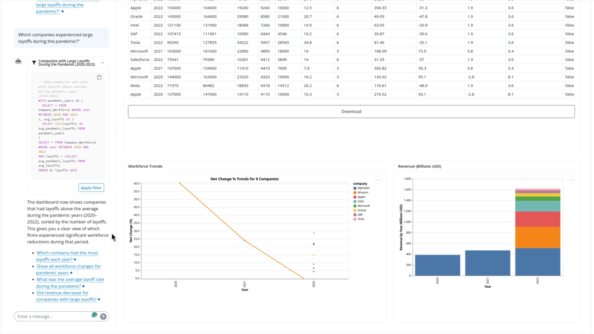
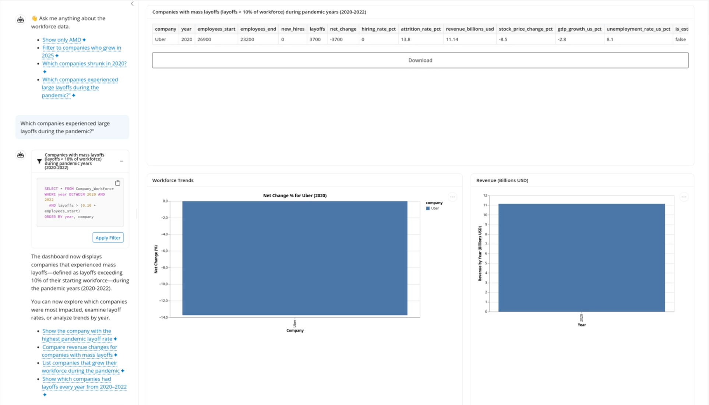

# Changelog

All notable changes to this project will be documented in this file.

The format is based on [Keep a Changelog](https://keepachangelog.com/en/1.0.0/), and this project adheres to [Semantic Versioning](https://semver.org/spec/v2.0.0.html). Following the [CHANGELOG and Reflection Guidelines](https://github.ubc.ca/mds-2025-26/DSCI_532_viz-2_students/blob/main/milestone1/general_guidelines.md#3-changelog-and-reflection-milestones-24)

## [0.4.0]

### Added

- KPI delta badges showing trend direction (▲/▼) and percentage change from start to end of selected date range
- Info banner on the LLM Chat tab clarifying that sidebar filters do not apply to the chat
- Footer with author names
- CSS flex-reverse on the QueryChat sidebar so the chat input appears at the top

### Changed

- Renamed "Hiring Metric:" selector to "Workforce Trends Metric:"
- KPI value box titles changed from dynamic (`output_text`) to fixed labels ("Hire-Layoff Ratio", "Total Hires", "Total Layoffs")
- KPI values switched from `render.text` to `render.ui` to support rich HTML delta badges
- Removed `.interactive()` from all Altair charts to prevent unintended zoom/scroll behaviour
- Removed chart zoom help text from sidebar
- Resized plots and edited axis labels to be more readable
- Wrapped chart widgets in `overflow:hidden` divs with `fill=False` to eliminate internal scrollbars
- Set LLM Chat `layout_sidebar` to fixed 900px height so the QueryChat panel scrolls internally
- Capped LLM Chat data table card at `max_height="400px"`

### Release Highlight: Addition of RAG Context/Knowledge Base

What we chose was the addition of a knowledge base to our chatbot. This was done due to the lackluster performance of the chatbot when making simple filtering queries such as "Which companies experience large layoffs during the pandemic?". Originally, the chatbot just chose companies that had a large number of layoffs but still grew by the end of the year. With the RAG context however, the chatbot now only showed companies (or in this case, company) that suffered a large layoff and shrunk in the year.

Below are 2 photos showcasing the query before and after the addition of the RAG context:

- **Option chosen:** C
- **PR:** #dbf80c4f5fe54722527f0b0d3f7266e6ae7b6411
- **Why this option over the others:** This option was chosen because the relevance of adding pertinent knowledge to the chatbot allowed it to answer basic queries more effectively and with more success rather than adding additional features.
- **Feature prioritization issue link:** #80

## [0.3.0]

### Additions

- A querychat AI chat interface
- A dataframe output component to see the filtered dataframe
- At least 2 other output component visualizations that use the querychat filtered dataframe (you can borrow from your original tab)
- A data download button that will download the querychat filtered dataframe

### Improvements/Fixed Issues

- Addressed all Milestone 2 Feedback (TA and Instructor)
- Relative scale for net change (net_change_pct)
- Add proper notations and format for the number texts
- Change dashboard layout to view plots simultaneously (potentially transpose numbers to the right side)

### Reflection 0.3.0

Based on the work completed so far as per Milestone 3 Guidelines, we have addressed all of the addition items as listed above. We have an AI chat interface which allows us to interact with the filtered data for hiring and layoff trends, alongside a data download button for the querychat filtered dataframe. The other dashboard specific additions are incorporated in `src/app.py` and changes are visible there. We also had certain visual issues for the dashboard that required improvements. By adding these changes, the layout is appropriate for both the user and contributors. These changes include formatting changes, creating new tabs, layout of graphs being accessed, etc.

## [0.2.0]

### Added

- Create an app specification file `m2_spec.md` with job stories, component inventory, reactivity diagram, and calculation details
- A deployment setup is created on Posit Cloud for both the `main` and `dev` branch
- Create `requirements.txt` file with the package dependencies for the dashboard app
- Changes in the M1 sketch in terms of implementable components and optional ones
- Create this `CHANGELOG.md` file to document notable changes

### Changed

- Updated README with the appropriate deployment links for the app
- Implemented all components of the app in `src.py`
- Update job stories from Milestone 1 to match app demands
- Update the component inventory with the functions and descriptions from app
- Updates to `environment.yml` file to match Shiny requirements
- Expand your README to serve two audiences: User and Contributors

### Fixed Issues

- Update the GitHub About section to include the Group Number and the app name
- Transition from improved environment.yml to a pinned requirements.txt for Posit Connect Cloud
- The outputs that were static were changed to reactive as per Milestone 1 Feedback
- Clearly explain the purpose of the app and the curiousity factors

### Reflection 0.2.0

Based on the current state of our app, we have implemented the functions for all job stories and this is a strong foundation for this dashboard. Further contributions and edits will be made over the next couple of milestones to ensure all job stories are appropriately considered and fulfilled. Currently, we have major components for each job story and optional filters as well.

## [0.1.0]

- Repository Creation and Metadata
- Add rough sketch of dashboard
- Create dashboard skeleton
- Add section 4 to proposal
- Add section 1 and 3 to proposal
- Complete Teamwork Contract
- Add CoC and DESCRIPTION
- Add CONTRIBUTING
- Add summary to README
- Add section 2 to the proposal
