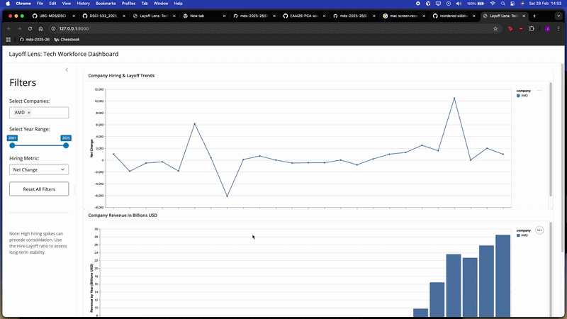

# Layoff Lens

Layoff Lens is an interactive Shiny dashboard designed to help job seekers and data scientists navigate the volatile tech employment landscape. By summarizing workforce trends across major tech companies from 2000 to 2025, the tool allows users to cut through the noise of high hiring numbers to identify companies with true net growth.

## Motivation

Raw hiring data can be misleading. We live in a market where a company might hire 1,000 people while simultaneously laying off 1,200. Layoff Lens safeguards users by visualizing the Net Change and Hire-Layoff Ratio. This allows applicants to prioritize companies with a healthy, expanding environment rather than those simply replacing churned staff, helping them avoid pull-back periods following rapid, unsustainable growth.

## Default Metrics

The **Company Insights** tab opens with four default metrics chosen to give an immediate, balanced picture of workforce health:

- **Net Change %** (Workforce Trends chart) — normalises headcount change by company size, so a 500-person swing at a 10,000-employee firm is directly comparable to one at a 200,000-employee firm. This is the default because absolute numbers can be misleading when comparing companies of very different scales.
- **Hire-Layoff Ratio** — a value above 1.0 means the company hired more people than it laid off over the selected period. This single number quickly separates genuinely growing firms from those that are simply back-filling departures.
- **Total Hires** — raw hiring volume signals how actively a company is recruiting, which matters to job seekers looking for open roles regardless of net growth.
- **Total Layoffs** — surfaces contraction risk. Even a company with strong net growth may have conducted significant layoffs in specific years, and this metric highlights that.

Each KPI includes a delta badge (▲/▼) comparing the value at the end of the selected date range to the start, so users can see at a glance whether a metric is trending up or down.

## Deployed Dashboards

- [Stable Version](https://019c8d0c-d197-57fd-3fdf-d468eac4c556.share.connect.posit.cloud/)
- [Development Preview](https://019c8d14-1608-8384-81a5-8d19259745d4.share.connect.posit.cloud/)

## Dashboard Demo

The following is a demo of our dashboard and how the components function: 



## Local Development

To run the dashboard locally, follow these steps:

### 1 Clone the Repository

```bash
git clone https://github.com/UBC-MDS/DSCI-532_2026_11_LayoffLens.git
cd DSCI-532_2026_11_LayoffLens
```

### 2 Set Up the Environment

Ensure you have `conda` or `mamba` installed.

```bash
# Create and activate a virtual environment
conda env create -f environment.yml
conda activate layoff-lens

# Install dependencies
pip install -r requirements.txt
```

### 3 Configure API Credentials for AI Features

The "LLM Chat" tab requires a GitHub Personal Access Token (PAT) to access the AI models.

1. Generate a Token
   - GitHub Settings > Developer Settings > Personal Access Tokens > Fine-grained tokens.
2. Grant Read-only access to Models for this repository.
3. Create a file named .env in the root directory.
4. Copy the format from .env.example and add your token.

### 4 Run the Dashboard

Use the Shiny CLI to run the app:

```bash
shiny run --reload src/app.py
```

Ensure "hot reload" is enabled. This allows the app to refresh automatically when you save changes.

Once running, open the link displayed on your terminal to view the dashboard.

### 5 Test the Dashboard

Ensure that you have playwright installed before running the test

```bash
# Install playwright
pip install playwright
playwright install

# Run tests
pytest
```

## Contributing

Interested in contributing to **LayoffLens**? We welcome pull requests! Please review our [CONTRIBUTING.md](CONTRIBUTING.md) for details on our code of conduct, branch naming conventions, and the process for submitting pull requests.

## License

This project is licensed under the MIT License. See the [LICENSE](LICENSE) file for details.
