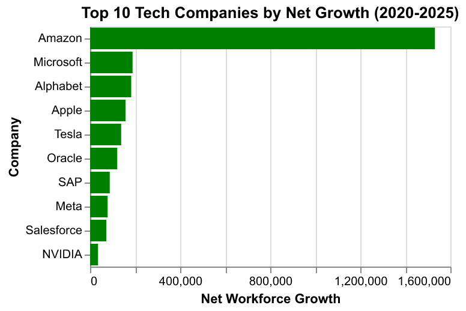

# Milestone 1 Proposal

## Section 1: Motivation and Purpose

Tech companies comprise a significant proportion of the market economy; Alphabet, Amazon, Apple, Microsoft, and NVIDIA alone represent approximately 30% of the S&P 500. Their most recent surge in prevalence is largely owed to their aggressive investment in artificial intelligence. Consequently, there are few more interested in the hiring trends of tech companies than emerging data scientists.

New data scientists face increasingly fierce competition, uncertain job markets, and constant shifts in trends. This dashboard seeks to address these needs by succintly visualizing the current hiring and layoff trends of major tech companies. This tool would allow recent data science graduates to locate growing or shrinking teams at a glance and make more informed decisions about their applications.

## Section 3: Research Questions & Usage Scenarios

**Persona:**
John Doe is a recent Master’s student in Data Science who is both eager and anxious about the current state of the tech job market. He is a recent graduate of his master program and lacks business context. He hears constant news about the latest AI trends and the growing layoffs in the tech industry. As he contemplates that starting point of his career, he'd like to learn more about the current state of hiring in tech.

**Usage Scenario:**
John logs into the dashboard on Monday morning. He isn't just looking for open jobs; he is assessing the health and opportunity of the tech job market. He navigates to the "Hiring Trends" visualization to see which companies are trending in his target city (e.g., Vancouver). He sees that Amazon is increasing their hiring, so he begins to tailor is resume and projects towards securing Amazon roles. He then navigates to the "Layoff Trends" visualization to identify the companies that are less likely to increase their workforce.

**User Stories / JTBD:**

* **Hiring Analysis:** "As a job seeker, I want to visualize the distribution of hiring across all the major tech companies to assess where my application efforts would be most fruitful."
* **Layoff Monitoring:** "When I search a company, I want to know if they're downsizing or laying off workers so that I can devote less time applying there."
* **Company Job Health Tracking:** "As an applicant, I want to view the companies with increasing revenue and a hiring:layoff ratio to determine which companies seem to be growing their team."

## Section 4: Exploratory Data Analysis

We conducted an initial analysis in the [EDA Notebook](../notebooks/eda_analysis.ipynb) to ensure our dataset supports the user stories defined in Section 3.

**User Story Addressed:** Hiring Analysis

**Visualization Summary:**  

To address this, we generated a **Net Workforce Growth** bar chart by calculating a new feature, `net_change` (`new_hires` - `layoffs`), which represents the true expansion or contraction of a company's workforce.

*Figure 1: Net workforce growth across major tech companies. Green bars indicate a positive hiring-to-layoff ratio.*

**Support for Decision-Making:**

This visualization directly helps John Doe by filtering out the noise in high hiring numbers. For instance, a company might hire 1,000 people but lay off 1,200. By visualizing the net change, John can identify which companies are truly expanding their teams rather than just replacing churned staff. This allows him to prioritize applications for companies with a positive green bar, which represents a healthier job environment.

## Section 5: App Sketch & Description

Taking all the user stories above into consideration, we designed an appropriate sketch of the dashboard expectations we look to present in later explorations within the milestones.

*Figure 1: A general sketch of the layoff and hiring trends within companies of interest through a dashboard*

**Description:**

The landing page for our dashboard is the main page, consisting of multiple filter, statistical and visual components. There are three pages within the menu bar in top right, where one can reference different pages beyond the landing one, *Dataset* and *Statistics*. With respect to the components, on the left side of the dashboard, there is a chart containing the layoff horizontal bar chart containing the total number of layoffs within the FAANG companies with a filter for checking these numbers by year (2001-2025). Then there is another barchart representing the net workforce growth in the top ten companies from 2020 to 2025. Towards the right side of the dashboard sketch, there are three sections; 1. *Net Workforce Growth (Average)* containing the statistical fact regarding the number of hires minus layoffs on average over past 5 years, 2. *Unemployment Rate* statistics component with two filters for company and year (2001-2025) of interest, 3. *Quarterly Revenue* barchart containing a companies revenue by quarter (1-4) with a filter option for company of interest. This is a high-level overview of the critical parts the dashboard we are implementing will attempt to integrate.
