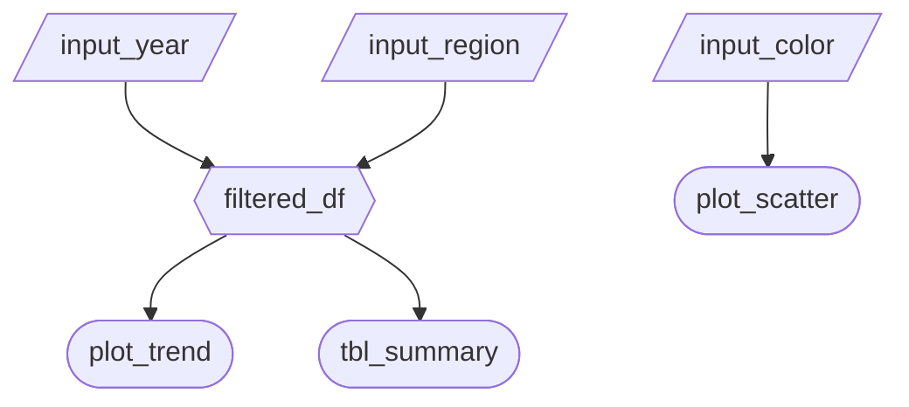

# Milestone 2 - App Specification

## Job Stories

| # | Job Story                                                                                                                                                               | Status        | Notes |
| - | ----------------------------------------------------------------------------------------------------------------------------------------------------------------------- | ------------- | ----- |
| 1 | As a job seeker, I want to visualize the distribution of hiring across all the major tech companies to assess where my application efforts would be most fruitful. | ⏳ Pending M2 | ...   |
| 2 | When I search a company, I want to know if they're downsizing or laying off workers so that I can devote less time applying there.                                 | ⏳ Pending M2 | ...   |
| 3 | As an applicant, I want to view the companies with increasing revenue and a hiring:layoff ratio to determine which companies seem to be growing their team         | ⏳ Pending M2 | ...   |

## Component Inventory

| ID                     | Type       | Shiny widget/renderer | Depends on                            | Job Story    |
| ---------------------- | ---------- | --------------------- | ------------------------------------- | ------------ |
| company                | Input      | `ui.input_selectize()`                   |                                       | #1, #2,  #3 |
| year                   | Input      | `ui.input_slider()`                   |                                       | #1, #2, #3   |
| tech_companies         | Expression | idk                   | company                               | #1           |
| net_change             | Input      | idk                   |                                       | #1           |
| plot_tech_hires        | Output     | idk                   | tech_companies, net_change, year | #1           |
| layoffs                | Input      | idk                   |                                       | #2           |
| plot_layoffs           | Output     | idk                   | company, layoffs, year      | #2           |
| revenue_billions_usd   | Input      | idk                   |                                       | #3           |
| new_hires              | Input      | idk                   |                                       | #3           |
| hire_layoff_ratio      | Expression | idk                   | layoffs, new_hires, company      | #3           |
| plot_revenue_workforce | Output     | idk                   | hire_layoff_ratio, year          | #3           |
| filtered_df | Expression     | `@reactive.calc`                   | company, year          | #3           |
| plot_trends | Output     | `@render_altair`                   | filtered_df          | #3           |

## Reactivity Diagram

Draw your planned reactive graph as a Mermaid flowchart using the notation from Lecture 3:

[/Input/] (Parallelogram) (or [Input] Rectangle) = reactive input
Hexagon {{Name}} = @reactive.calc expression
Stadium ([Name]) (or Circle) = rendered output

## Calculation Details

For each @reactive.calc in your diagram, briefly describe:

- Which inputs it depends on.
- What transformation it performs (e.g., "filters rows to the selected year range and region(s)").
- Which outputs consume it.

1 `filtered_df`:

- Depends on: `input.company` and `input.year`.
- Transformation: Filters the raw dataset to include only the selected companies and the specified range of years.
- Consumers: `plot_trends`.