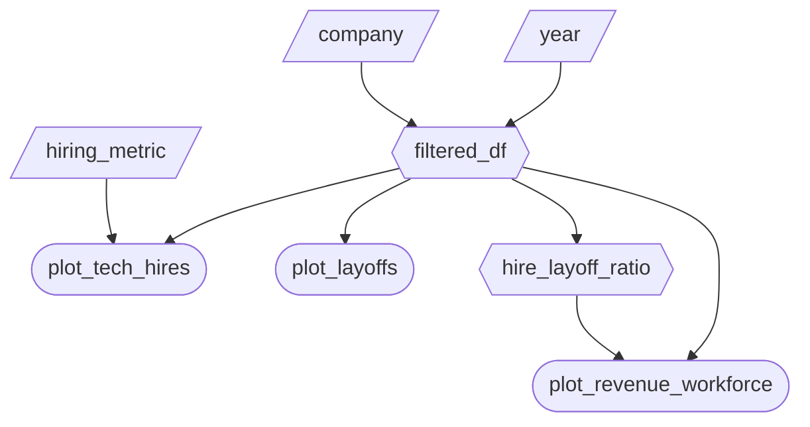

# Milestone 2 - App Specification

## Job Stories

| # | Job Story                                                                                                                                                               | Status        | Notes |
| - | ----------------------------------------------------------------------------------------------------------------------------------------------------------------------- | ------------- | ----- |
| 1 | As a job seeker, I want to visualize the distribution of hiring across all the major tech companies to assess where my application efforts would be most fruitful. | ⏳ Pending M2 | ...   |
| 2 | When I search a company, I want to know if they're downsizing or laying off workers so that I can devote less time applying there. | ⏳ Pending M2 | ...   |
| 3 | As an applicant, I want to view the companies with increasing revenue and a hiring:layoff ratio to determine which companies seem to be growing their team. | ⏳ Pending M2 | ...   |
| 4 | As an applicant, I want to reset all filters to see the full picture of the tech job market or make different selections. | ⏳ Pending M2 | *Optional Complexity Feature* |

## Component Inventory

| ID                     | Type       | Shiny widget/renderer                                     | Depends on                     | Job Story  |
| ---------------------- | ---------- | --------------------------------------------------------- | ------------------------------ | ---------- |
| company                | Input      | `ui.input_selectize(multiple=True)`                       |                                | #1, #2, #3 |
| year                   | Input      | `ui.input_slider(min=2001, max=2025, value=[2001, 2025])` |                                | #1, #2, #3 |
| hiring_metric          | Input      | `ui.input_select()`                                       |                                | #1         |
| filtered_df            | Expression | `@reactive.calc`                                          | company, year                  | #1, #2, #3 |
| hire_layoff_ratio      | Expression | `@reactive.calc`                                          | filtered_df                    | #3         |
| plot_tech_hires        | Output     | `@render_altair`                                          | filtered_df, hiring_metric     | #1         |
| plot_layoffs           | Output     | `@render_altair`                                          | filtered_df                    | #2         |
| plot_revenue_workforce | Output     | `@render_altair`                                          | filtered_df, hire_layoff_ratio | #3         |
| reset                  | Input      | `ui.input_action_button("reset", "Reset All Filters")`    |                                | #4         |

## Reactivity Diagram

Draw your planned reactive graph as a Mermaid flowchart using the notation from Lecture 3:

[/Input/] (Parallelogram) (or [Input] Rectangle) = reactive input
Hexagon {{Name}} = @reactive.calc expression
Stadium ([Name]) (or Circle) = rendered output

## Calculation Details

**`filtered_df`**

- **Depends on:** `company`, `year`
- **Transformation:** Filters the raw CSV to only the rows matching the selected company/companies and the selected year range.
- **Consumed by:** `plot_tech_hires`, `plot_layoffs`, `hire_layoff_ratio`, `plot_revenue_workforce`

**`hire_layoff_ratio`**

- **Depends on:** `filtered_df`
- **Transformation:** Adds a computed column `new_hires / layoffs` (guarded against division by zero) to the filtered dataframe. Represents how many people a company hires for every one it lays off.
- **Consumed by:** `plot_revenue_workforce`
